# SOPS Private Key Storage in SSM Parameter Store

## Problem

When init_job repackages orders, it generates an age key pair to encrypt credentials with SOPS. The **private key is lost** after init_job Lambda finishes — it lives only in a temp file during execution. Workers (Lambda/CodeBuild) receive the encrypted `secrets.enc.json` in exec.zip but have **no way to get the private key for decryption**.

In `src/worker/run.py:46-51`, the worker checks for `SOPS_AGE_KEY` or `SOPS_AGE_KEY_FILE` environment variables, but neither is ever set by the dispatch code.

## Solution

Store the SOPS private key in SSM Parameter Store as SecureString during init_job's repackage step. Workers fetch it from SSM to decrypt. Orchestrator cleans up the parameter during finalization.

**SSM path convention:** `/iac-ci/sops-keys/<run_id>/<order_num>`

## Files to Change

### 1. `src/common/sops.py` — Add SSM key storage/retrieval + return private key

- `_generate_age_key()`: Also read and return private key content from temp file
  - Current return: `(public_key, key_file_path)`
  - New return: `(public_key, key_file_path, secret_key_content)`

- `encrypt_env()`: Return private key content as third element
  - Current return: `(encrypted_file, sops_key)`
  - New return: `(encrypted_file, sops_key, secret_key_or_none)`
  - When auto-generating: return the private key content
  - When caller provides `sops_key`: return `None` (caller manages their own key)

- Add `store_sops_key_ssm(run_id, order_num, key_content, region)` — stores in SSM as SecureString
- Add `fetch_sops_key_ssm(ssm_path, region)` — retrieves from SSM
- Add `delete_sops_keys_ssm(run_id, order_nums, region)` — batch deletes for cleanup

- `repackage_order()`: Return `(code_dir, secret_key_or_none)` instead of just `code_dir`

### 2. `src/common/bundler.py` — Propagate private key return

- `OrderBundler.repackage()`: Return `(result_dir, secret_key_or_none)` instead of just `result_dir`

### 3. `src/init_job/repackage.py` — Store private key in SSM after repackage

- After `bundler.repackage()`, call `sops.store_sops_key_ssm()` if private key returned
- Add `sops_key_ssm_path` to result dict

### 4. `src/init_job/insert.py` — Store SSM path in DynamoDB order record

- Add `sops_key_ssm_path` to `order_data` dict

### 5. `src/orchestrator/dispatch.py` — Pass SSM path to workers

- `_dispatch_lambda()`: Add `sops_key_ssm_path` to payload
- `_dispatch_codebuild()`: Add `SOPS_KEY_SSM_PATH` env var override

### 6. `src/worker/handler.py` — Extract and pass SSM path

- Extract `sops_key_ssm_path` from event, pass to `run()`

### 7. `src/worker/run.py` — Fetch key from SSM for decryption

- `run()`: Accept `sops_key_ssm_path` parameter
- `_decrypt_and_load_env()`: Try SSM first, then fall back to `SOPS_AGE_KEY` / `SOPS_AGE_KEY_FILE` env vars
- For CodeBuild: also check `os.environ.get("SOPS_KEY_SSM_PATH")` as fallback

### 8. `src/orchestrator/finalize.py` — Clean up SSM parameters

- After writing done endpoint, delete SSM parameters for the run

### 9. `infra/02-deploy/iam.tf` — Add SSM permissions

- init_job: add `ssm:PutParameter` scoped to `/iac-ci/sops-keys/*`
- worker: add `ssm:GetParameter` scoped to `/iac-ci/sops-keys/*`
- codebuild: add `ssm:GetParameter` scoped to `/iac-ci/sops-keys/*`
- orchestrator: add `ssm:DeleteParameter` scoped to `/iac-ci/sops-keys/*`

### 10. Tests

- `tests/unit/test_sops.py`: Update for 3-tuple returns, add SSM function tests
- `tests/unit/test_bundler.py`: Update for tuple return from `repackage()`
- `tests/unit/test_worker_run.py`: Add SSM key fetch test
- `tests/unit/test_dispatch.py`: Verify `sops_key_ssm_path` passed in payloads

## Data Flow

```mermaid
flowchart TB
    subgraph InitJob["init_job"]
        S1["1. _generate_age_key()<br><i>→ public_key, key_file, private_key_content</i>"]
        S2["2. encrypt_env(env_vars)<br><i>→ encrypted_file, public_key, private_key_content</i>"]
        S3["3. store_sops_key_ssm()<br><i>run_id, order_num → SSM path</i>"]
        S4["4. SSM path saved<br><i>in DynamoDB order record</i>"]
    end

    subgraph Dispatch["orchestrator/dispatch"]
        S5["5. Read order from DynamoDB<br><i>includes sops_key_ssm_path</i>"]
        S6["6. Pass sops_key_ssm_path<br><i>Lambda payload / CodeBuild env var</i>"]
    end

    subgraph WorkerPhase["worker"]
        S7["7. Receive sops_key_ssm_path"]
        S8["8. fetch_sops_key_ssm()<br><i>→ private_key_content</i>"]
        S9["9. sops.decrypt_env()<br><i>→ env vars</i>"]
        S10["10. Execute commands<br><i>with decrypted env vars</i>"]
    end

    subgraph Finalize["finalize"]
        S11["11. delete_sops_keys_ssm()<br><i>run_id, order_nums → cleanup</i>"]
    end

    S1 --> S2 --> S3 --> S4
    S4 --> S5 --> S6
    S6 --> S7 --> S8 --> S9 --> S10
    S10 --> S11

    style S1 fill:#2d1052,stroke:#a855f7,color:#e2e8f0
    style S2 fill:#2d1052,stroke:#a855f7,color:#e2e8f0
    style S3 fill:#3d2b00,stroke:#eab308,color:#e2e8f0
    style S4 fill:#1e3a5f,stroke:#3b82f6,color:#e2e8f0
    style S5 fill:#1e3a5f,stroke:#3b82f6,color:#e2e8f0
    style S6 fill:#3d1f00,stroke:#f97316,color:#e2e8f0
    style S7 fill:#3d1f00,stroke:#f97316,color:#e2e8f0
    style S8 fill:#3d2b00,stroke:#eab308,color:#e2e8f0
    style S9 fill:#2d1052,stroke:#a855f7,color:#e2e8f0
    style S10 fill:#3d1f00,stroke:#f97316,color:#e2e8f0
    style S11 fill:#3d0a0a,stroke:#ef4444,color:#e2e8f0
    style InitJob fill:#1a1a2e,stroke:#f97316,color:#e2e8f0
    style Dispatch fill:#1a1a2e,stroke:#3b82f6,color:#e2e8f0
    style WorkerPhase fill:#1a1a2e,stroke:#a855f7,color:#e2e8f0
    style Finalize fill:#1a1a2e,stroke:#ef4444,color:#e2e8f0
```

