# Architecture

## System Overview

iac-ci is a generic, event-driven execution system. It receives jobs containing orders, queues them, and executes them via AWS Lambda, CodeBuild, or SSM Run Command with dependency resolution, cross-account credential management, and VCS PR tracking.

The system is split into three flows:

- **Part 1 (init_job):** Receive, validate, package (with SOPS), and queue Lambda/CodeBuild orders
- **Part 1b (ssm_config):** Receive, validate, package (no SOPS), and queue SSM Run Command orders
- **Part 2 (execute_orders):** Orchestrate execution of queued orders across all three targets

---

## Part 1: init_job Lambda

### Upstream

Commands are resolved before entering this system. For example, an IAC layer translates `tf_plan:::tofu:1.6` into concrete shell commands before triggering. By the time a job reaches init_job, every order has a concrete `cmds[]` list. This system does not know or care what the commands do.

### Trigger Sources

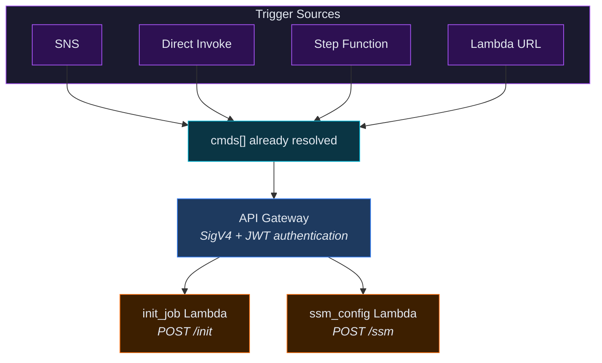

### Flow

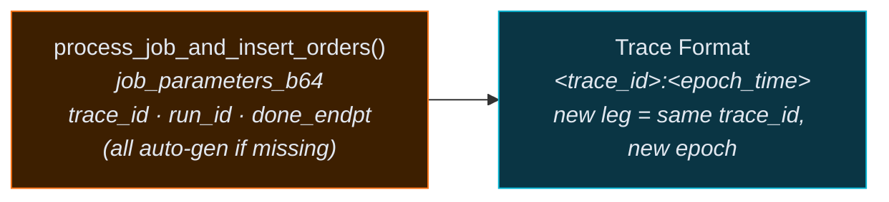

**Step 1: Generate Flow ID + Validate**

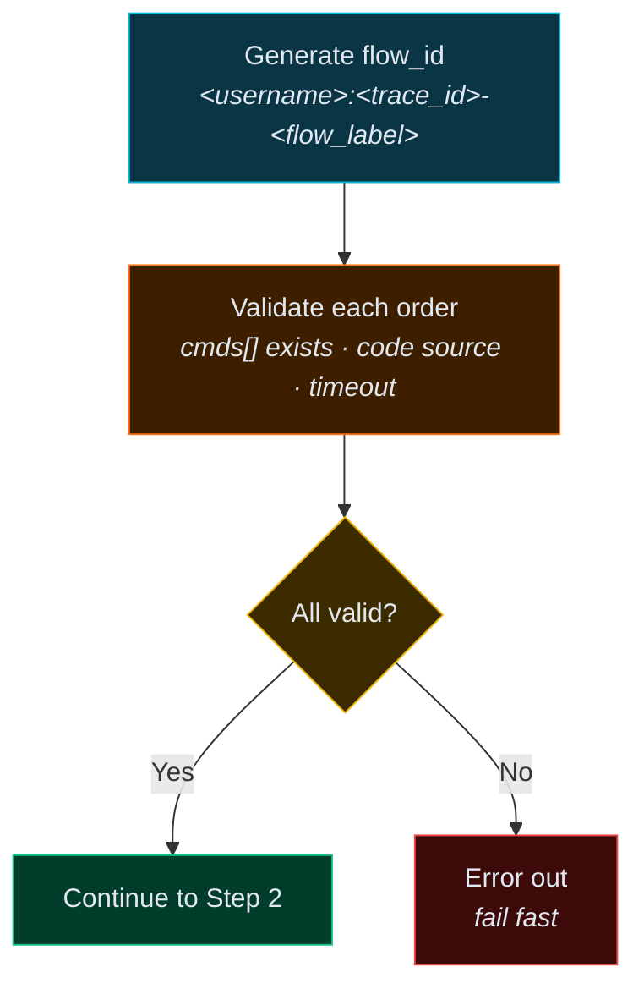

**Step 2: Repackage Each Order**

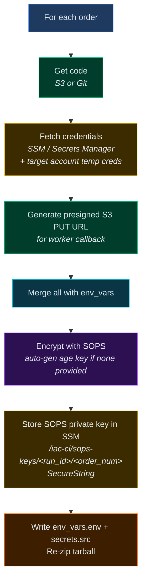

**Step 3: Upload to S3**

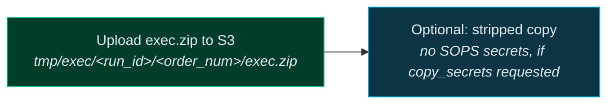

**Step 4: Insert Orders to DynamoDB**

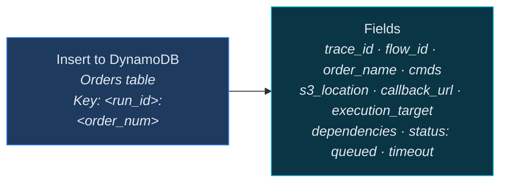

**Step 5: Init PR Comment**

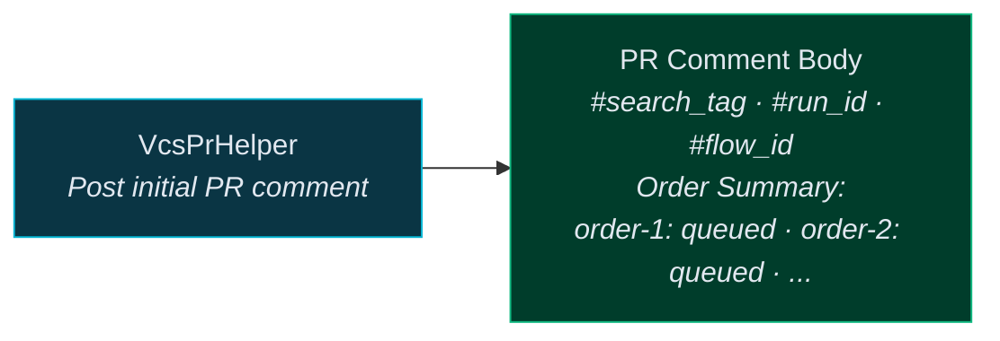

**Step 6: Kick Off Orchestrator**

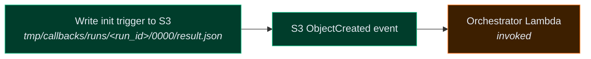

**Response**

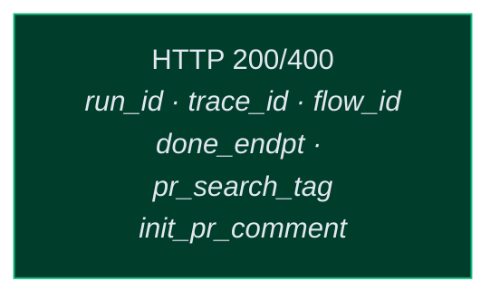

---

## Part 1b: ssm_config (SSM Config Provider Lambda)

Separate construction point for SSM Run Command orders. Receives jobs via `POST /ssm`, uses `SsmJob`/`SsmOrder` models instead of `Job`/`Order`, and does not use SOPS encryption.

### Flow

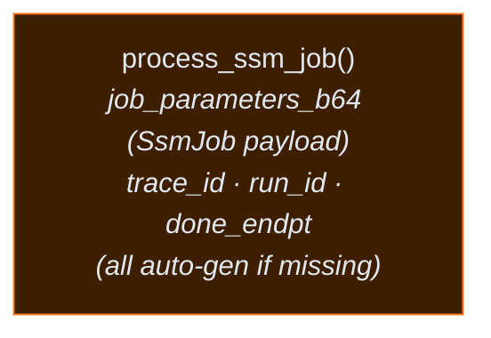

**Step 1: Validate SSM Orders**

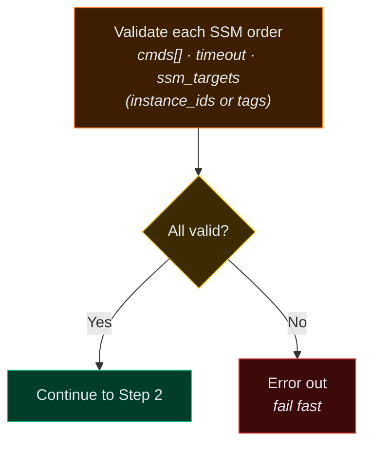

**Step 2: Repackage (No SOPS)**

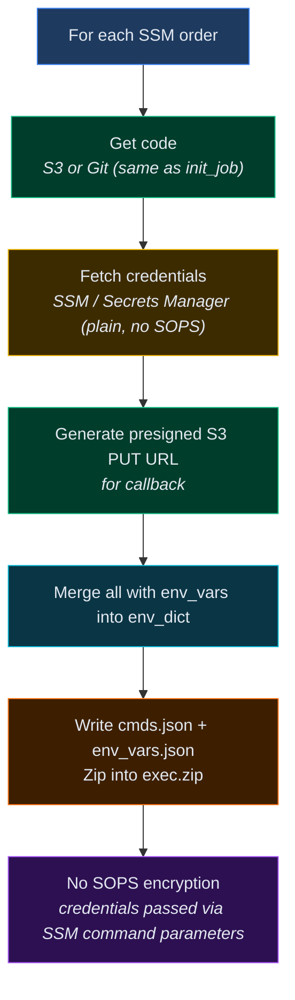

**Step 3: Upload to S3**

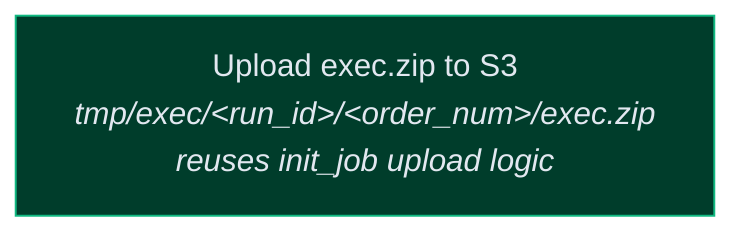

**Step 4: Insert Orders to DynamoDB**

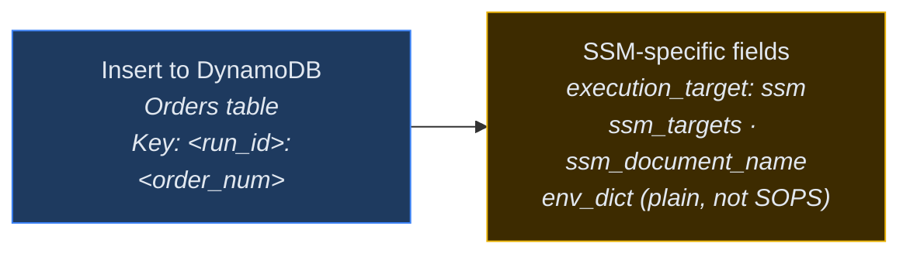

**Step 5: Kick Off Orchestrator**

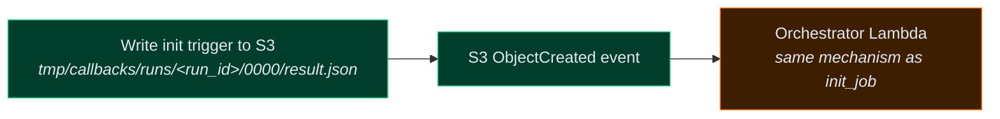

**Response**

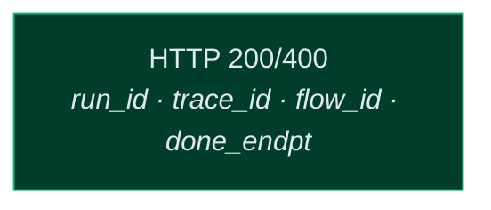

**Key differences from init_job:**
- No SOPS encryption — env vars and credentials are passed as plain SSM command parameters
- No PR comment step — SSM orders are typically infrastructure-level, not PR-driven
- Uses `SsmJob`/`SsmOrder` models with SSM-specific fields (`ssm_targets`, `ssm_document_name`)
- Orders always get `execution_target: "ssm"` in DynamoDB

---

## Part 2: execute_orders (Orchestrator Lambda)

### Trigger Mechanism

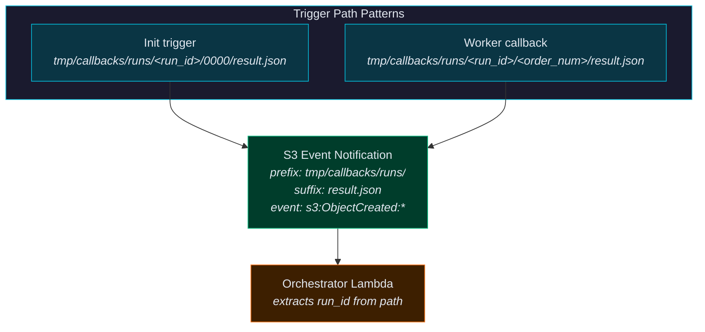

### Flow

**Lock Acquisition**

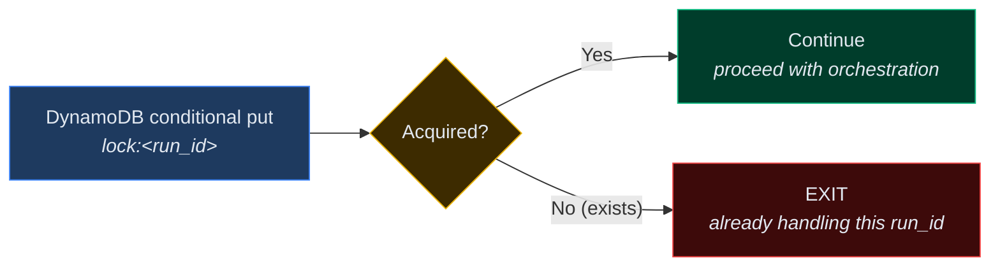

**Step 1: Read State**

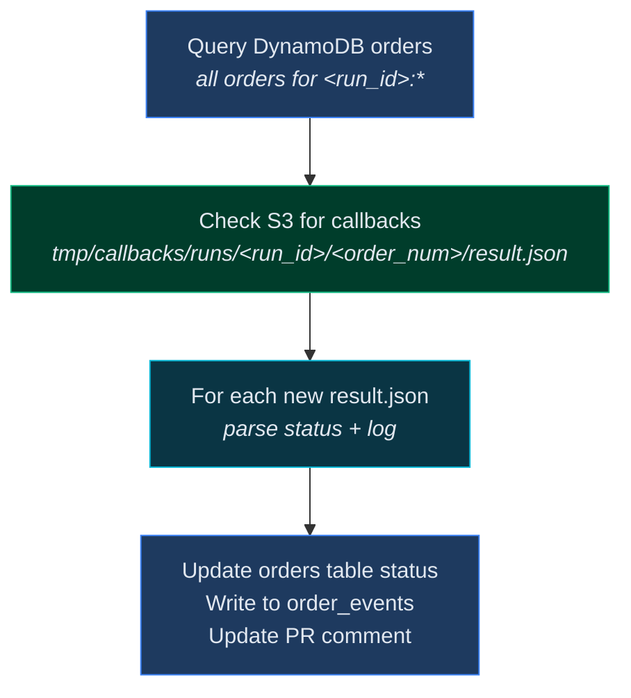

**Step 2: Evaluate Dependencies**

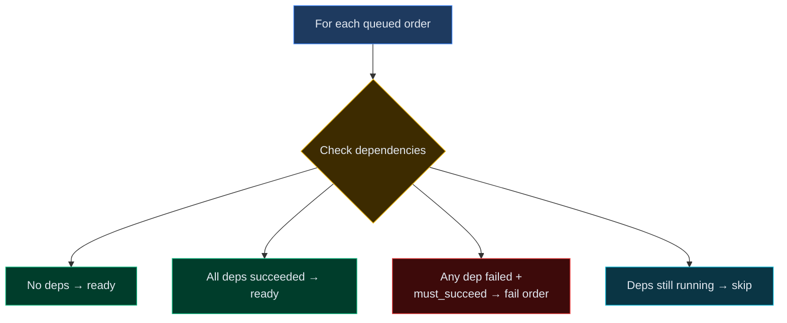

**Step 3: Dispatch (parallel)**

```mermaid
flowchart TB
    Ready["For each ready order"]
    Target{"execution_target?"}
    Lambda["Invoke worker Lambda"]
    CB["Start CodeBuild project"]
    SSMCmd["Send SSM Run Command"]
    Compat["Backward compat<br><i>use_lambda=true → lambda</i><br><i>use_lambda=false → codebuild</i>"]
    Post["Start watchdog Step Function<br>Update status → running<br>Write order_event: dispatched<br>Update PR comment"]

    Ready --> Target
    Target -- "lambda" --> Lambda --> Post
    Target -- "codebuild" --> CB --> Post
    Target -- "ssm" --> SSMCmd --> Post
    Target -. "use_lambda fallback" .-> Compat

    style Ready fill:#1e3a5f,stroke:#3b82f6,color:#e2e8f0
    style Target fill:#3d2b00,stroke:#eab308,color:#e2e8f0
    style Lambda fill:#3d1f00,stroke:#f97316,color:#e2e8f0
    style CB fill:#2d1052,stroke:#a855f7,color:#e2e8f0
    style SSMCmd fill:#3d2b00,stroke:#eab308,color:#e2e8f0
    style Compat fill:#0a3544,stroke:#06b6d4,color:#e2e8f0
    style Post fill:#003d2b,stroke:#10b981,color:#e2e8f0
```

**Step 4: Check Completion**

```mermaid
flowchart LR
    Check{"All orders done?<br><i>succeeded / failed / timed_out</i>"}
    No["Release lock<br><i>next S3 callback will re-trigger</i>"]
    Yes["Finalize"]

    Check -- "No" --> No
    Check -- "Yes" --> Yes

    style Check fill:#3d2b00,stroke:#eab308,color:#e2e8f0
    style No fill:#0a3544,stroke:#06b6d4,color:#e2e8f0
    style Yes fill:#003d2b,stroke:#10b981,color:#e2e8f0
```

**Step 5: Finalize**

```mermaid
flowchart TB
    Event["Write job-level order_event<br><i>_job:epoch</i><br><i>status · done_endpt · summary</i>"]
    Done["Write done endpoint<br><i>s3://done-bucket/&lt;run_id&gt;/done</i>"]
    PR["Final PR comment<br><i>full summary</i>"]
    Lock["Release lock<br><i>status → completed</i>"]

    Event --> Done --> PR --> Lock

    style Event fill:#1e3a5f,stroke:#3b82f6,color:#e2e8f0
    style Done fill:#003d2b,stroke:#10b981,color:#e2e8f0
    style PR fill:#0a3544,stroke:#06b6d4,color:#e2e8f0
    style Lock fill:#1e3a5f,stroke:#3b82f6,color:#e2e8f0
```

### Job-Level Status Resolution

```mermaid
flowchart TB
    Check{"Job-Level Status Resolution"}
    Succeeded["All orders succeeded → job succeeded"]
    Failed["Any must_succeed order failed → job failed"]
    Timeout["Job-level timeout exceeded → job timed_out"]

    Check --> Succeeded
    Check --> Failed
    Check --> Timeout

    style Check fill:#3d2b00,stroke:#eab308,color:#e2e8f0
    style Succeeded fill:#003d2b,stroke:#10b981,color:#e2e8f0
    style Failed fill:#3d0a0a,stroke:#ef4444,color:#e2e8f0
    style Timeout fill:#3d1f00,stroke:#f97316,color:#e2e8f0
```

---

## Worker

Same code runs in Lambda and CodeBuild Docker container.

```mermaid
flowchart TB
    Fetch["1. Fetch exec.zip from S3"]
    SSM["2. Fetch SOPS private key from SSM<br><i>/iac-ci/sops-keys/&lt;run_id&gt;/&lt;order_num&gt;</i>"]
    Decrypt["3. Decrypt SOPS → env vars<br><i>AWS creds · custom env vars · CALLBACK_URL</i>"]
    Run["4. Run cmds<br><i>os.system / subprocess.Popen, no buffering</i>"]
    Capture["5. Capture exit code + stdout/stderr"]
    Callback["6. PUT result.json to CALLBACK_URL<br><i>status: succeeded/failed/timed_out + log</i>"]
    S3Event["7. S3 event fires<br><i>→ orchestrator re-triggered</i>"]

    Fetch --> SSM --> Decrypt --> Run --> Capture --> Callback --> S3Event

    style Fetch fill:#003d2b,stroke:#10b981,color:#e2e8f0
    style SSM fill:#3d2b00,stroke:#eab308,color:#e2e8f0
    style Decrypt fill:#2d1052,stroke:#a855f7,color:#e2e8f0
    style Run fill:#3d1f00,stroke:#f97316,color:#e2e8f0
    style Capture fill:#3d1f00,stroke:#f97316,color:#e2e8f0
    style Callback fill:#003d2b,stroke:#10b981,color:#e2e8f0
    style S3Event fill:#003d2b,stroke:#10b981,color:#e2e8f0
```

No IAM role switching. Worker only operates with target account credentials from SOPS. Worker needs ssm:GetParameter on /iac-ci/sops-keys/* to fetch the decryption key. Callback uses presigned URL (no additional AWS permissions needed).

---

## SSM Run Command Execution

For orders with `execution_target: "ssm"`, the orchestrator sends an SSM Run Command instead of invoking Lambda or CodeBuild.

```mermaid
flowchart TB
    Send["1. Orchestrator calls ssm:SendCommand<br><i>DocumentName · Targets · Parameters</i>"]

    subgraph Params["SSM Command Parameters"]
        Doc["DocumentName<br><i>order-level or default iac-ci-run-commands</i>"]
        Targets["Targets<br><i>instance_ids or tag-based</i>"]
        CmdParams["Commands · CallbackUrl · Timeout<br><i>EnvVars (plain text) · S3Location</i>"]
    end

    subgraph Instance["SSM Document on Target Instance"]
        Export["Export env vars"]
        Download["Download + extract exec.zip<br><i>(if provided)</i>"]
        Exec["Execute commands sequentially"]
        Cap["Capture exit code + stdout/stderr"]
        Put["PUT result.json to CallbackUrl"]
    end

    S3Event["3. S3 event fires<br><i>→ orchestrator re-triggered</i>"]

    Send --> Doc
    Send --> Targets
    Send --> CmdParams
    CmdParams --> Export --> Download --> Exec --> Cap --> Put --> S3Event

    style Send fill:#3d1f00,stroke:#f97316,color:#e2e8f0
    style Doc fill:#3d2b00,stroke:#eab308,color:#e2e8f0
    style Targets fill:#3d2b00,stroke:#eab308,color:#e2e8f0
    style CmdParams fill:#3d2b00,stroke:#eab308,color:#e2e8f0
    style Export fill:#0a3544,stroke:#06b6d4,color:#e2e8f0
    style Download fill:#003d2b,stroke:#10b981,color:#e2e8f0
    style Exec fill:#3d1f00,stroke:#f97316,color:#e2e8f0
    style Cap fill:#3d1f00,stroke:#f97316,color:#e2e8f0
    style Put fill:#003d2b,stroke:#10b981,color:#e2e8f0
    style S3Event fill:#003d2b,stroke:#10b981,color:#e2e8f0
    style Params fill:#1a1a2e,stroke:#eab308,color:#e2e8f0
    style Instance fill:#1a1a2e,stroke:#06b6d4,color:#e2e8f0
```

No SOPS. Credentials and env vars are passed directly as SSM command parameters. The SSM document handles env var export, command execution, and callback — same result.json contract as Lambda/CodeBuild workers.

---

## Watchdog (Timeout Safety Net)

Per-order Step Function started at dispatch time.

```mermaid
flowchart TB
    Check{"result.json<br>exists in S3?"}
    ExitOK["EXIT<br><i>worker completed</i>"]
    Timeout{"Timeout<br>exceeded?"}
    WriteTimeout["Write result.json<br><i>status: timed_out</i>"]
    ExitTimeout["EXIT<br><i>timed out</i>"]
    Wait["Wait 60s"]

    Check -- "Yes" --> ExitOK
    Check -- "No" --> Timeout
    Timeout -- "Yes" --> WriteTimeout --> ExitTimeout
    Timeout -- "No" --> Wait --> Check

    style Check fill:#2d1052,stroke:#a855f7,color:#e2e8f0
    style ExitOK fill:#003d2b,stroke:#10b981,color:#e2e8f0
    style Timeout fill:#3d2b00,stroke:#eab308,color:#e2e8f0
    style WriteTimeout fill:#3d0a0a,stroke:#ef4444,color:#e2e8f0
    style ExitTimeout fill:#3d0a0a,stroke:#ef4444,color:#e2e8f0
    style Wait fill:#0a3544,stroke:#06b6d4,color:#e2e8f0
```

Timeout distributed to three places: SOPS env var (worker self-enforces), DynamoDB (record keeping), Step Function (safety net).

---

## Cross-Account Execution Model

```mermaid
flowchart TB
    subgraph Repackage["Repackage Step (init_job)"]
        Fetch["Fetch from SSM / Secrets Manager<br><i>target account temp creds</i><br><i>+ env_vars + presigned callback URL</i>"]
        Encrypt["Encrypt all via SOPS (age key)<br><i>→ packed into exec.zip</i>"]
        Store["Store SOPS private key in SSM<br><i>/iac-ci/sops-keys/&lt;run_id&gt;/&lt;order_num&gt;</i><br><i>SecureString</i>"]
    end

    subgraph Worker["Worker Execution"]
        FetchKey["Fetch SOPS private key from SSM"]
        Decrypt["Decrypt SOPS → env vars<br><i>AWS_ACCESS_KEY_ID · AWS_SECRET_ACCESS_KEY</i><br><i>AWS_SESSION_TOKEN · CALLBACK_URL</i><br><i>CUSTOM_VAR_1, etc.</i>"]
        Run["Run cmds<br><i>operates as target account</i>"]
        Callback["Callback via presigned URL<br><i>zero AWS context needed</i>"]
    end

    Fetch --> Encrypt --> Store
    Store --> FetchKey --> Decrypt --> Run --> Callback

    style Fetch fill:#3d2b00,stroke:#eab308,color:#e2e8f0
    style Encrypt fill:#2d1052,stroke:#a855f7,color:#e2e8f0
    style Store fill:#3d2b00,stroke:#eab308,color:#e2e8f0
    style FetchKey fill:#3d2b00,stroke:#eab308,color:#e2e8f0
    style Decrypt fill:#2d1052,stroke:#a855f7,color:#e2e8f0
    style Run fill:#3d1f00,stroke:#f97316,color:#e2e8f0
    style Callback fill:#003d2b,stroke:#10b981,color:#e2e8f0
    style Repackage fill:#1a1a2e,stroke:#f97316,color:#e2e8f0
    style Worker fill:#1a1a2e,stroke:#a855f7,color:#e2e8f0
```

No dual-credential context switching. Worker has a single execution context.

---

## S3 Layout

### Internal Bucket (1 day lifecycle)

```mermaid
graph TB
    Bucket["s3://internal-bucket/"]
    Tmp["tmp/"]
    Exec["exec/"]
    Callbacks["callbacks/runs/"]
    RunExec["&lt;run_id&gt;/&lt;order_num&gt;/"]
    ExecZip["exec.zip"]
    RunCb["&lt;run_id&gt;/"]
    Init["0000/result.json<br><i>init trigger</i>"]
    Worker["&lt;order_num&gt;/result.json<br><i>worker callback</i>"]

    Bucket --> Tmp
    Tmp --> Exec --> RunExec --> ExecZip
    Tmp --> Callbacks --> RunCb
    RunCb --> Init
    RunCb --> Worker

    style Bucket fill:#003d2b,stroke:#10b981,color:#e2e8f0
    style Tmp fill:#003d2b,stroke:#10b981,color:#e2e8f0
    style Exec fill:#0a3544,stroke:#06b6d4,color:#e2e8f0
    style Callbacks fill:#0a3544,stroke:#06b6d4,color:#e2e8f0
    style RunExec fill:#1e3a5f,stroke:#3b82f6,color:#e2e8f0
    style ExecZip fill:#2d1052,stroke:#a855f7,color:#e2e8f0
    style RunCb fill:#1e3a5f,stroke:#3b82f6,color:#e2e8f0
    style Init fill:#3d1f00,stroke:#f97316,color:#e2e8f0
    style Worker fill:#3d1f00,stroke:#f97316,color:#e2e8f0
```

### Done Bucket (1 day lifecycle, separate for security)

```mermaid
graph LR
    Bucket["s3://done-bucket/"]
    Run["&lt;run_id&gt;/"]
    Done["done"]

    Bucket --> Run --> Done

    style Bucket fill:#003d2b,stroke:#10b981,color:#e2e8f0
    style Run fill:#1e3a5f,stroke:#3b82f6,color:#e2e8f0
    style Done fill:#003d2b,stroke:#10b981,color:#e2e8f0
```

### State Bucket (permanent)

```mermaid
graph TB
    Bucket["s3://state-bucket/<br><i>permanent</i>"]
    ECR["ecr/terraform.tfstate"]
    Deploy["deploy/terraform.tfstate"]
    Archive["archive/iac-ci-teardown-&lt;sha&gt;.zip"]

    Bucket --> ECR
    Bucket --> Deploy
    Bucket --> Archive

    style Bucket fill:#003d2b,stroke:#10b981,color:#e2e8f0
    style ECR fill:#0a3544,stroke:#06b6d4,color:#e2e8f0
    style Deploy fill:#0a3544,stroke:#06b6d4,color:#e2e8f0
    style Archive fill:#0a3544,stroke:#06b6d4,color:#e2e8f0
```

---

## DynamoDB Tables

### Orders

```mermaid
graph TB
    Table["Orders Table<br><i>PK: &lt;run_id&gt;:&lt;order_num&gt; · TTL: 1 day</i>"]
    Core["Core Fields<br><i>trace_id · flow_id · order_name · cmds</i><br><i>queue_id · s3_location · callback_url</i>"]
    Exec["Execution Fields<br><i>execution_target · dependencies · status</i><br><i>timeout · must_succeed · git (b64)</i>"]
    SSMFields["SSM-Only Fields<br><i>ssm_targets · ssm_document_name</i><br><i>env_dict (plain credentials)</i>"]

    Table --> Core
    Table --> Exec
    Table --> SSMFields

    style Table fill:#1e3a5f,stroke:#3b82f6,color:#e2e8f0
    style Core fill:#0a3544,stroke:#06b6d4,color:#e2e8f0
    style Exec fill:#3d1f00,stroke:#f97316,color:#e2e8f0
    style SSMFields fill:#3d2b00,stroke:#eab308,color:#e2e8f0
```

### Order Events

```mermaid
graph TB
    Table["Order Events Table<br><i>PK: trace_id · SK: order_name:epoch</i><br><i>TTL: 90 days</i>"]
    GSI["GSI<br><i>PK: order_name · SK: epoch</i>"]

    subgraph Examples["Event Examples"]
        OrderEvent["Order-level<br><i>deploy-vpc:1708099200 → dispatched</i><br><i>deploy-vpc:1708099240 → succeeded</i>"]
        JobEvent["Job-level (reserved: _job)<br><i>_job:1708099100 → job_started</i><br><i>_job:1708099300 → job_completed</i>"]
    end

    Table --> GSI
    Table --> OrderEvent
    Table --> JobEvent

    style Table fill:#1e3a5f,stroke:#3b82f6,color:#e2e8f0
    style GSI fill:#2d1052,stroke:#a855f7,color:#e2e8f0
    style OrderEvent fill:#0a3544,stroke:#06b6d4,color:#e2e8f0
    style JobEvent fill:#3d1f00,stroke:#f97316,color:#e2e8f0
    style Examples fill:#1a1a2e,stroke:#06b6d4,color:#e2e8f0
```

### Orchestrator Locks

```mermaid
graph LR
    Table["Orchestrator Locks Table<br><i>PK: lock:&lt;run_id&gt; · TTL: max_timeout</i>"]
    Fields["Fields<br><i>orchestrator_id · status (active/completed)</i><br><i>acquired_at · flow_id · trace_id</i>"]

    Table --> Fields

    style Table fill:#1e3a5f,stroke:#3b82f6,color:#e2e8f0
    style Fields fill:#0a3544,stroke:#06b6d4,color:#e2e8f0
```

---

## Tracing

```mermaid
graph TB
    subgraph Format["Trace & Flow ID Formats"]
        TraceID["trace_id format<br><i>&lt;trace_id&gt;:&lt;epoch_time&gt;</i><br><i>same trace_id across entire run</i><br><i>new epoch per significant leg</i>"]
        FlowID["flow_id format<br><i>&lt;username&gt;:&lt;trace_id&gt;-&lt;flow_label&gt;</i><br><i>flow_label defaults to exec</i><br><i>stored in DynamoDB, PR comments, scheduler</i>"]
    end

    subgraph Trace["Example Trace Across Legs (a3f7b2c1)"]
        T1[":1708099200<br><i>validation</i>"]
        T2[":1708099203<br><i>repackage</i>"]
        T3[":1708099207<br><i>upload</i>"]
        T4[":1708099208<br><i>insert</i>"]
        T5[":1708099209<br><i>pr_comment</i>"]
        T6[":1708099210<br><i>dispatch</i>"]
        T7[":1708099240<br><i>orch_read</i>"]
        T8[":1708099242<br><i>orch_dispatch</i>"]
        T9[":1708099300<br><i>finalize</i>"]
    end

    T1 --> T2 --> T3 --> T4 --> T5 --> T6 --> T7 --> T8 --> T9

    style TraceID fill:#0a3544,stroke:#06b6d4,color:#e2e8f0
    style FlowID fill:#2d1052,stroke:#a855f7,color:#e2e8f0
    style T1 fill:#3d1f00,stroke:#f97316,color:#e2e8f0
    style T2 fill:#3d1f00,stroke:#f97316,color:#e2e8f0
    style T3 fill:#003d2b,stroke:#10b981,color:#e2e8f0
    style T4 fill:#1e3a5f,stroke:#3b82f6,color:#e2e8f0
    style T5 fill:#0a3544,stroke:#06b6d4,color:#e2e8f0
    style T6 fill:#3d1f00,stroke:#f97316,color:#e2e8f0
    style T7 fill:#1e3a5f,stroke:#3b82f6,color:#e2e8f0
    style T8 fill:#3d1f00,stroke:#f97316,color:#e2e8f0
    style T9 fill:#003d2b,stroke:#10b981,color:#e2e8f0
    style Format fill:#1a1a2e,stroke:#06b6d4,color:#e2e8f0
    style Trace fill:#1a1a2e,stroke:#f97316,color:#e2e8f0
```

---

## TTL / Cleanup Strategy

```mermaid
graph TB
    subgraph TTL["TTL / Cleanup Strategy"]
        Presign["Presigned URLs<br><i>default 2 hours (configurable)</i>"]
        IntS3["Internal S3 bucket<br><i>1 day lifecycle rule</i>"]
        DoneS3["Done S3 bucket<br><i>1 day lifecycle rule</i>"]
        OrdersTTL["Orders table<br><i>1 day DynamoDB TTL</i>"]
        LocksTTL["Orchestrator locks<br><i>TTL = max_timeout of run</i>"]
        EventsTTL["Order events table<br><i>90 day DynamoDB TTL (+ GSI)</i>"]
        SOPSClean["SOPS keys (SSM)<br><i>deleted on job finalization</i>"]
    end

    style Presign fill:#0a3544,stroke:#06b6d4,color:#e2e8f0
    style IntS3 fill:#003d2b,stroke:#10b981,color:#e2e8f0
    style DoneS3 fill:#003d2b,stroke:#10b981,color:#e2e8f0
    style OrdersTTL fill:#1e3a5f,stroke:#3b82f6,color:#e2e8f0
    style LocksTTL fill:#1e3a5f,stroke:#3b82f6,color:#e2e8f0
    style EventsTTL fill:#1e3a5f,stroke:#3b82f6,color:#e2e8f0
    style SOPSClean fill:#3d2b00,stroke:#eab308,color:#e2e8f0
    style TTL fill:#1a1a2e,stroke:#06b6d4,color:#e2e8f0
```

Nothing runs 24/7. No manual cleanup required.

---

## Event-Driven Wave Execution Example

```mermaid
sequenceDiagram
    participant IJ as init_job
    participant S3 as S3 (callbacks)
    participant Orch as Orchestrator
    participant O1 as order-1<br>(no deps)
    participant O2 as order-2<br>(no deps)
    participant O3 as order-3<br>(deps: 1, 2)

    IJ->>S3: Write .../0000/result.json
    S3-->>Orch: S3 event
    Note over Orch: Acquire lock<br>Dispatch wave 1

    par Wave 1
        Orch->>O1: Dispatch order-1
        Orch->>O2: Dispatch order-2
    end
    Note over Orch: Release lock

    O1->>S3: Write result.json (succeeded)
    S3-->>Orch: S3 event
    Note over Orch: Acquire lock<br>order-3 deps: order-1 ✅, order-2 running<br>Nothing to dispatch<br>Release lock

    O2->>S3: Write result.json (succeeded)
    S3-->>Orch: S3 event
    Note over Orch: Acquire lock<br>order-3 deps: order-1 ✅, order-2 ✅

    Orch->>O3: Dispatch order-3 (wave 2)
    Note over Orch: Release lock

    O3->>S3: Write result.json (succeeded)
    S3-->>Orch: S3 event
    Note over Orch: Acquire lock<br>All done → finalize<br>Write done endpoint<br>Release lock
```
