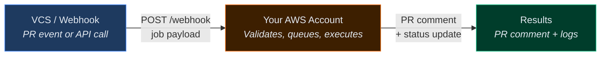
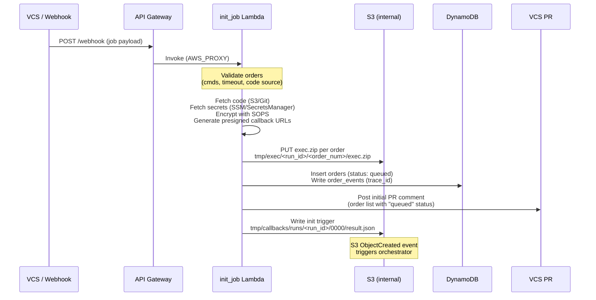
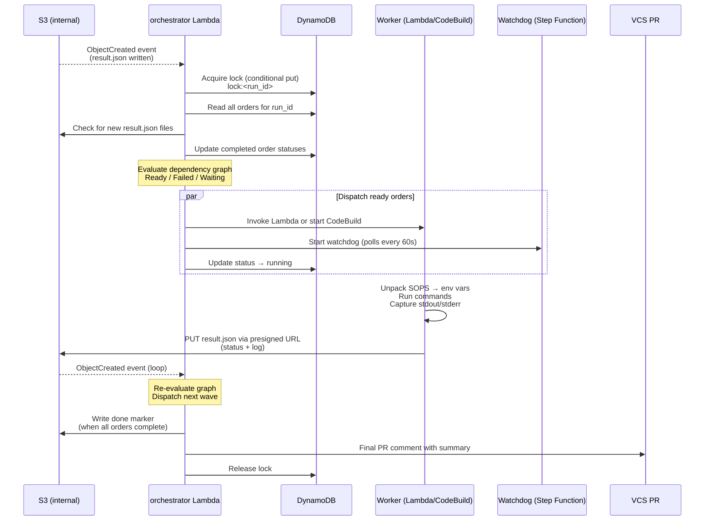
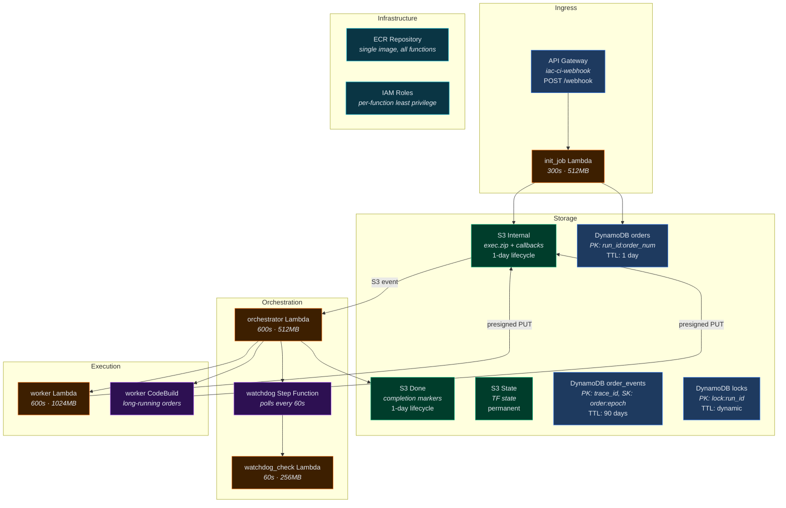

# Architecture Diagram

Visual overview of the iac-ci system. For an interactive version with full details, open [architecture-diagram.html](architecture-diagram.html) in a browser.

---

## System Overview

**Key properties:**
- Fully serverless -- nothing runs 24/7
- All working data auto-cleans via TTL and S3 lifecycle
- Single Docker image for all Lambda functions and CodeBuild

---

## Part 1: init_job

Webhook intake -- validates, packages, and queues orders.

---

## Part 2: execute_orders

Event-driven orchestration -- resolves dependencies and dispatches work.

---

## AWS Resources

---

## Deployment Pipeline

```mermaid
flowchart LR
    B["1. Bootstrap<br><i>S3 state bucket</i><br>Terraform, local state"]
    E["2. ECR<br><i>Create repository</i><br>Terraform, remote state"]
    D["3. Docker<br><i>Build & push image</i><br>SHA + latest tags"]
    T["4. Deploy<br><i>All AWS resources</i><br>Terraform, remote state"]
    S["5. Smoke Tests<br><i>Verify API, Lambda,</i><br><i>DDB, S3, ECR</i>"]
    A["6. Archive<br><i>Zip TF + tfvars</i><br>Upload for teardown"]

    B --> E --> D --> T --> S --> A

    style B fill:#003d2b,stroke:#10b981,color:#e2e8f0
    style E fill:#0a3544,stroke:#06b6d4,color:#e2e8f0
    style D fill:#2d1052,stroke:#a855f7,color:#e2e8f0
    style T fill:#3d1f00,stroke:#f97316,color:#e2e8f0
    style S fill:#1e3a5f,stroke:#3b82f6,color:#e2e8f0
    style A fill:#3d2b00,stroke:#eab308,color:#e2e8f0
```

