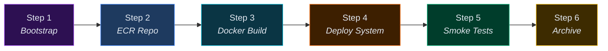
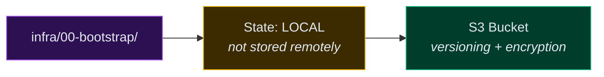
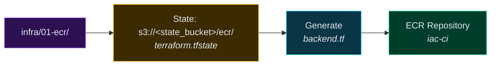
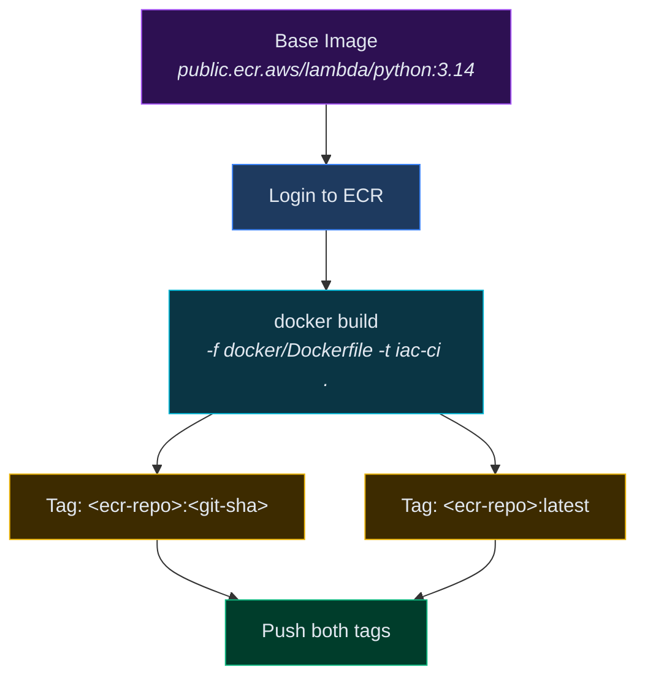
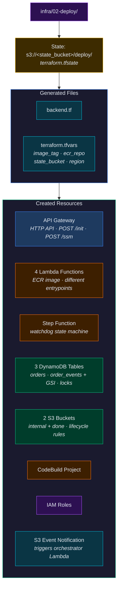
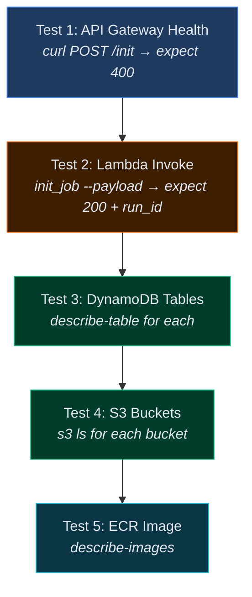
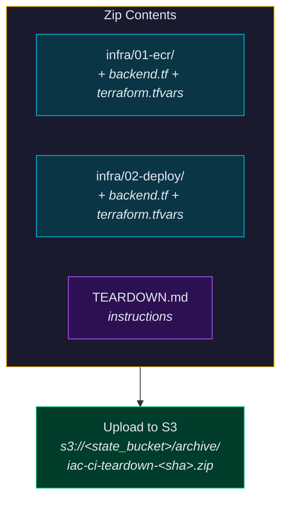
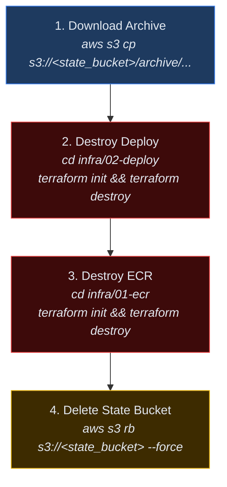

# Deploy

## GitHub Actions Workflow

Single workflow (`deploy.yml`) handles the entire deploy pipeline in 6 steps.



### Inputs

| Parameter | Type | Description |
|---|---|---|
| `AWS_ACCESS_KEY_ID` | secret | AWS access key |
| `AWS_SECRET_ACCESS_KEY` | secret | AWS secret key |
| `aws_region` | input (required) | e.g. `us-east-1` |
| `state_bucket_name` | input (optional) | Auto-generated if not provided |

If `state_bucket_name` is not provided, one is generated:

```
state_bucket_name = "iac-ci-state-${random_5_chars}"
```

### Derived / Opinionated Defaults

| Variable | Value |
|---|---|
| `project_name` | `iac-ci` |
| `ecr_repo_name` | `iac-ci` |
| `image_tag` | `<git-sha>` |
| `hash` | `sha256(state_bucket_name + aws_region)[-5:]` |
| `internal_bucket` | `iac-ci-internal-${hash}` |
| `done_bucket` | `iac-ci-done-${hash}` |

---

## Step 1: Bootstrap State Bucket



> [!IMPORTANT]
> This is the **one resource** the user must manually delete when tearing down.

---

## Step 2: Create ECR Repo



---

## Step 3: Build + Push Docker Image



---

## Step 4: Deploy System



---

## Step 5: Smoke Tests



---

## Step 6: Archive for Teardown



---

## Teardown

To destroy this system, follow the steps below in order:



**1. Download teardown archive:**

```bash
aws s3 cp s3://<state_bucket>/archive/iac-ci-teardown-<sha>.zip .
unzip iac-ci-teardown-<sha>.zip
```

**2. Destroy deploy resources:**

```bash
cd infra/02-deploy
terraform init
terraform destroy
```

**3. Destroy ECR:**

```bash
cd infra/01-ecr
terraform init
terraform destroy
```

**4. Manually delete state bucket:**

```bash
aws s3 rb s3://<state_bucket> --force
```

> [!WARNING]
> The state bucket is the only resource not tracked in Terraform state that must be manually removed.
